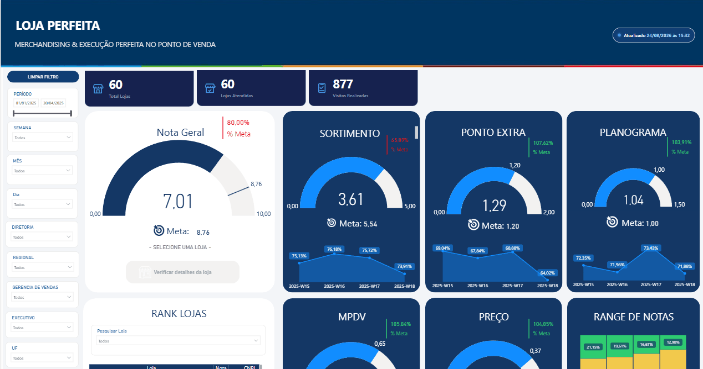
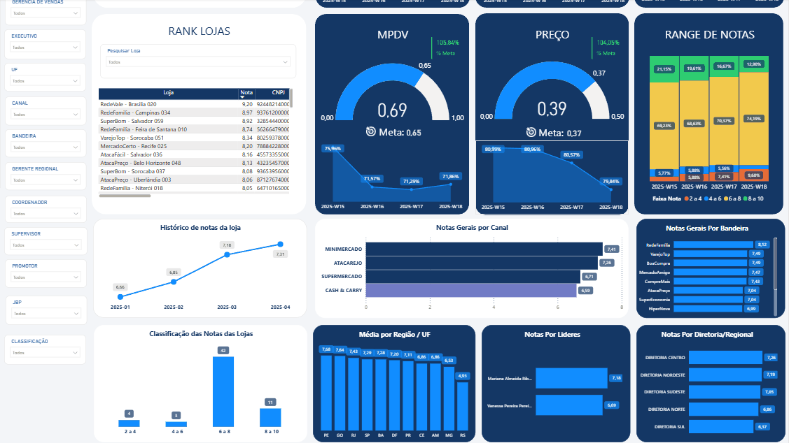
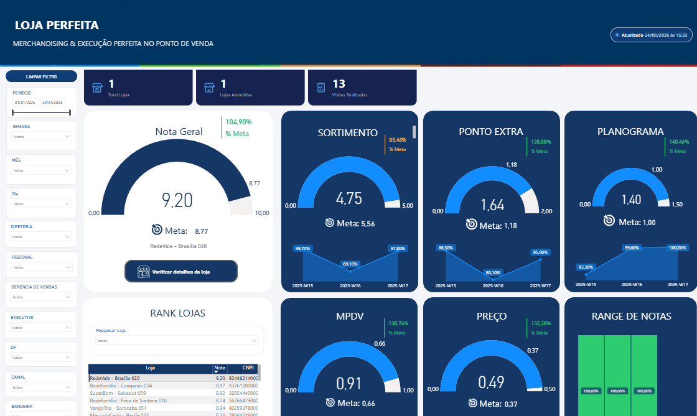
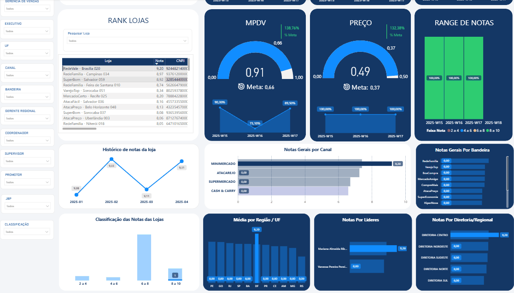
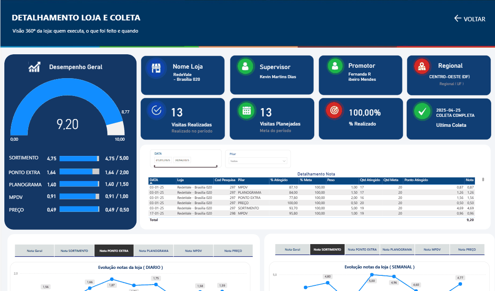
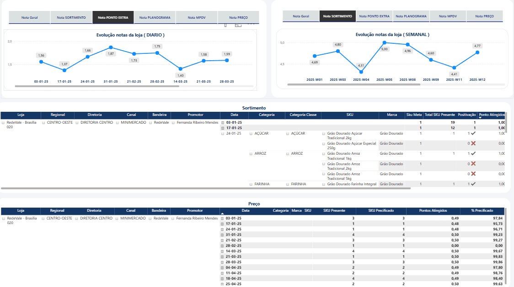
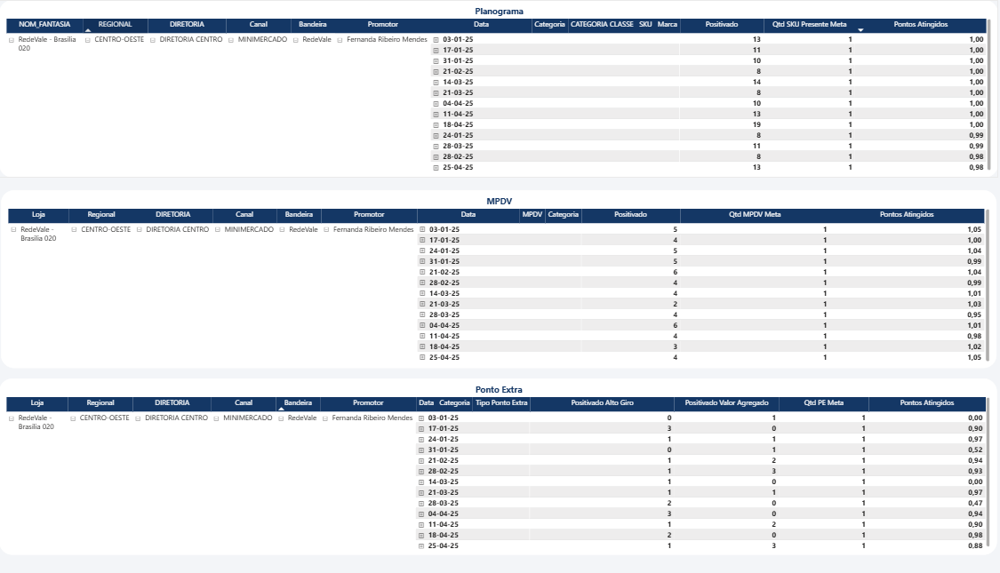
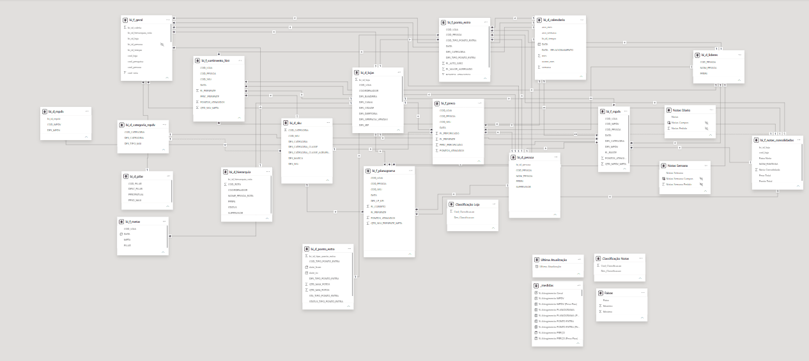
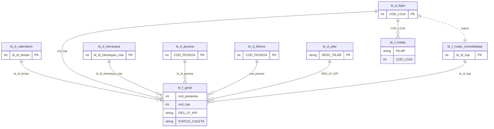
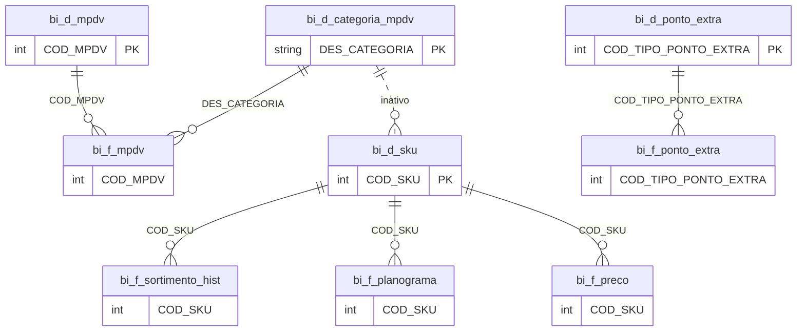

# Loja Perfeita: painel de execução em loja (Power BI)

Transforma visitas de campo em uma nota de 0 a 10 por loja, quebrada em cinco pilares, comparada com metas e navegável da visão executiva até o detalhe de cada SKU.

> **Todos os dados são 100 % sintéticos.** Lojas, bandeiras, marcas, SKUs, pessoas e resultados foram gerados para este projeto e não representam nenhuma empresa real. O modelo é genérico e se aplica a qualquer operação de trade marketing e merchandising no varejo.

[Problema](#o-problema-que-o-painel-resolve) · [Nota](#como-a-nota-é-calculada) · [Tour](#tour-pelo-painel) · [Modelo](#modelo-de-dados) · [DAX](#medidas-dax) · [Dados](#dados) · [Como usar](#como-usar) · [Estrutura](#estrutura-do-repositório) · [Autor](#autor)



## O problema que o painel resolve

Uma operação de campo visita muitas lojas e coleta vários indicadores em cada visita. Sem um critério único, cada indicador conta uma história diferente e ninguém sabe se a loja está bem executada. O painel resolve isso com uma **nota única de 0 a 10**, composta por pilares com pesos definidos, comparada com uma meta e classificada em faixas, sempre com o caminho de volta ao dado que originou a nota.

**O que ele responde**

- Qual é a nota geral da operação no período e qual o atingimento da meta?
- Quais pilares puxam a nota para cima e quais puxam para baixo?
- Quantas lojas estão em cada faixa de nota?
- Quais canais, bandeiras, UFs, líderes e diretorias estão acima ou abaixo da média?
- A cobertura de visitas está em dia (planejado x realizado)?
- Para uma loja específica: quem executa, quando foi a última coleta, quais SKUs estão ausentes e como estão planograma, MPDV, ponto extra e preço?

**A história que os dados sintéticos contam.** Com o painel sem filtro, a Nota Geral é 7,01 contra meta de 8,76 (80,00 % da meta, em vermelho). Quatro dos cinco pilares passam da meta: Ponto Extra 107,62 %, Planograma 103,91 %, MPDV 105,84 % e Preço 104,05 %. O Sortimento, que vale 50 % da nota, está em 3,61 de 5,00 contra meta de 5,54 (65,09 %, vermelho) e é o único pilar abaixo da meta. É ele que puxa a nota geral para 80 % da meta. O painel indica onde olhar; o detalhe por loja e por SKU mostra o que foi ou não encontrado em cada visita.

## Como a nota é calculada

Cada visita avalia **5 pilares**. Os pesos somam 10, então a nota da visita já sai na escala de 0 a 10.

| Pilar | Peso | O que mede |
|---|---|---|
| Sortimento | 5,0 | Presença dos SKUs esperados na loja |
| Ponto Extra | 2,0 | Pontos de exposição adicionais (ilha, cabeceira, ponta de gôndola e similares), com indicadores de alto giro e valor agregado |
| Planograma | 1,5 | SKUs presentes e corretos conforme o planograma |
| MPDV | 1,0 | Material de ponto de venda existente (clipstrip, wobbler, stopper e similares) |
| Preço | 0,5 | SKUs presentes e precificados |

- **Nota da visita** = soma de (% atingido do pilar x peso do pilar).
- **Nota do período** = média das notas das visitas com `STATUS_COLETA = "COLETA COMPLETA"`. Visitas parciais não entram na nota.
- **Meta:** valor mensal por loja e por pilar (tabela `bi_f_metas`), na mesma escala da nota do pilar. A meta da nota geral é a soma das metas dos pilares.
- **Semáforo de meta:** verde a partir de 100 % de atingimento, amarelo a partir de 85 %, vermelho abaixo de 85 %.

**Faixas de nota.** O painel usa dois esquemas, e vale conhecer os dois:

- **Distribuição de lojas** (gráfico Classificação das Notas das Lojas, Range de Notas e filtro Classificação): faixas de 2 pontos, `0 a 2`, `2 a 4`, `4 a 6`, `6 a 8` e `8 a 10`. A faixa de cada loja é calculada em Power Query sobre todas as visitas completas carregadas.
- **Medida `[Classificação Notas]`:** rotula uma nota com cortes em 9, 7, 5 e 3 (`9 a 10`, `7 a 8`, `5 a 6`, `3 a 4` e `0 a 2`). Fica disponível no modelo para novas visões.

Trechos reais copiados do arquivo:

```dax
-- Nota Geral do Período
VAR PontoSortimento = CALCULATE(
    SUM(bi_f_geral[PONTO_ATINGIDO]),
    bi_f_geral[DES_LP_KPI] = "SORTIMENTO",
    bi_f_geral[STATUS_COLETA] = "COLETA COMPLETA",
    bi_f_geral[PERC_ATINGIDO] <> BLANK()
)
VAR NotaGeral = DIVIDE(
    SUMX(
        FILTER(bi_f_geral,
            bi_f_geral[STATUS_COLETA] = "COLETA COMPLETA"
            && bi_f_geral[PERC_ATINGIDO] <> BLANK()
        ),
        (bi_f_geral[PERC_ATINGIDO] / 100) * bi_f_geral[PESO]
    ),

    CALCULATE(
        DISTINCTCOUNT(bi_f_geral[cod_pesquisa]),
        bi_f_geral[STATUS_COLETA] = "COLETA COMPLETA",
        bi_f_geral[PERC_ATINGIDO] <> BLANK()
    ),
    0
)

RETURN
IF(
    OR(PontoSortimento = 0, ISBLANK(PontoSortimento)),
    0,
    NotaGeral
)
```

```dax
-- Nota SORTIMENTO (cada pilar segue o mesmo padrão)
DIVIDE(
    SUMX(
        FILTER(bi_f_geral, bi_f_geral[DES_LP_KPI] = "SORTIMENTO" && bi_f_geral[STATUS_COLETA] = "COLETA COMPLETA"),
        (bi_f_geral[PERC_ATINGIDO] / 100) * bi_f_geral[PESO]
    ),
    CALCULATE(
        DISTINCTCOUNT(bi_f_geral[cod_pesquisa]),
        bi_f_geral[STATUS_COLETA] = "COLETA COMPLETA",
        bi_f_geral[PERC_ATINGIDO] <> BLANK()
    ),
    0
)

-- % Atingimento SORTIMENTO
DIVIDE([Nota SORTIMENTO], [Meta SORTIMENTO (Dinâmica)])

-- Cor Meta SORTIMENTO (formatação condicional dirigida por medida)
VAR _perc = [% Atingimento SORTIMENTO]
RETURN
SWITCH(
    TRUE(),
    _perc >= 1, "#2ECC71", -- Verde
    _perc >= 0.85, "#F2C94C", -- Amarelo
    "#FF1744" -- Vermelho (abaixo de 85%)
)
```

## Tour pelo painel

**Fluxo de navegação**

1. A página **Lojas Perfeita** abre sem filtro e mostra a operação inteira.
2. Clique em uma loja na tabela **Rank Lojas**. A página inteira passa a refletir apenas aquela loja.
3. O botão **Verificar detalhes da loja**, desabilitado enquanto nenhuma loja está selecionada, fica habilitado.
4. Ao clicar nele, o Power BI faz o drill-through para a página **Detalhamento** (título na tela: Detalhamento Loja e Coleta), a visão 360 da loja: quem executa, o que foi feito e quando.
5. O botão **VOLTAR** devolve para a visão executiva. O botão **Limpar filtro** remove as seleções.

O painel lateral de filtros cobre período, semana, mês, dia, diretoria, regional, gerência de vendas, executivo, UF, canal, bandeira, gerente regional, coordenador, supervisor, promotor, JBP e classificação. O carimbo "Atualizado" no topo mostra a hora da última atualização do modelo, não a data das visitas.

### Visão executiva: rankings e comparativos



Rolando a mesma página: Rank Lojas com busca, Range de Notas por semana, e as notas por canal (Minimercado 7,41 a maior, Cash & Carry 6,59 a menor), por UF (PE 7,68 a maior, RS 4,93 a menor), por líder, por bandeira e por diretoria (Centro 7,26, Sul 6,37). O gráfico Classificação das Notas das Lojas mostra 4 lojas em 2 a 4, 3 em 4 a 6, 42 em 6 a 8 e 11 em 8 a 10.

### Uma loja selecionada



Depois do clique em RedeVale - Brasília 020, os cards mostram 1 loja e 13 visitas, e a Nota Geral fica em 9,20 contra meta de 8,77 (104,90 %). O Sortimento da loja é 4,75 (85,48 %, amarelo pela regra do semáforo). O botão Verificar detalhes da loja agora está habilitado.



Rolando a página com a loja selecionada: o histórico mensal de notas passa a mostrar a série da loja, e os gráficos por canal, UF, líder e diretoria destacam a posição dela (Minimercado, DF, Diretoria Centro) e esmaecem o restante.

### Detalhamento Loja e Coleta



Visão 360 da loja: gauge de desempenho com a barra de cada pilar (nota sobre peso máximo), cards com loja, supervisor, promotor e regional (UF), visitas realizadas x planejadas (13 e 13, 100,00 %) e a última coleta (2025-04-25, COLETA COMPLETA). A tabela Detalhamento Nota abre a nota linha a linha (data, pilar, % atingido, % meta, peso, quantidades e pontos) e aceita filtro por data e por pilar.



Os botões de classificação (Nota Geral, Sortimento, Ponto Extra, Planograma, MPDV, Preço) escolhem qual pilar os gráficos de evolução diária e semanal exibem; não criam uma métrica nova, apenas trocam a medida mostrada. Abaixo, a matriz de Sortimento marca cada SKU como presente (check verde) ou ausente (X vermelho) por visita, e a matriz de Preço mostra SKUs presentes, precificados e o percentual precificado.



Fecham a página as matrizes de Planograma, MPDV e Ponto Extra, com o que foi positivado, a quantidade de referência (meta) e os pontos atingidos em cada visita. As linhas são expansíveis por data.

## Modelo de dados

O modelo é dimensional (esquema estrela com dimensões compartilhadas): 8 fatos, 10 dimensões, 6 tabelas de apoio e 1 tabela só de medidas. Print do diagrama completo no Power BI Desktop:

[](prints/08_modelo_de_dados.png)

Diagramas simplificados, só com as chaves de relacionamento. Linha tracejada indica relacionamento **inativo**.

**Nota, hierarquia e metas (fato `bi_f_geral`, uma linha por visita x pilar)**



**Fatos de detalhe por pilar**



Para manter os diagramas legíveis, alguns relacionamentos ficaram fora do desenho, todos do tipo muitos para um e ativos:

- Os cinco fatos de detalhe também se ligam a `bi_d_lojas` (`COD_LOJA`), `bi_d_calendario` (`DATA` para `DATA - RELACIONAMENTO`), `bi_d_pessoa` e `bi_d_lideres` (`COD_PESSOA`).
- `bi_f_sortimento_hist`, `bi_f_planograma`, `bi_f_mpdv` e `bi_f_ponto_extra` também se ligam a `bi_f_notas_consolidadas` por `COD_LOJA`. `bi_f_preco` não.
- Relacionamentos inativos (já marcados nos diagramas): `bi_d_lojas` com `bi_f_notas_consolidadas` (1:1, filtro nos dois sentidos) e `bi_d_categoria_mpdv` com `bi_d_sku`.

**Camadas do modelo**

- **Dimensões compartilhadas:** calendário, lojas, pessoas, líderes, hierarquia de rota, pilares, SKUs, MPDV, categorias de MPDV e tipos de ponto extra filtram todos os fatos que precisam delas. `bi_d_lideres` é derivada de `bi_d_pessoa` em Power Query (exclui os perfis ADM e PROMOTOR).
- **Notas consolidadas em Power Query:** `bi_f_notas_consolidadas` agrupa `bi_f_geral` por loja (só coletas completas), calcula a nota consolidada e a faixa de 2 pontos, e traz o nome fantasia por junção com lookup em buffer. Como é calculada na carga, a faixa da loja não muda com o filtro de datas.
- **Tabela de medidas separada:** todas as medidas ficam em `_medidas`, organizadas em pastas.
- **Cálculos internos separados dos publicados:** a pasta `Cálculos Internos` guarda a nota auxiliar e os numeradores por pilar, fora das medidas de negócio.
- **Field parameters:** `Notas Diario` e `Notas Semana` são tabelas de parâmetro de campo (`NAMEOF`) que alimentam os botões de pilar dos gráficos de evolução.
- **Tabelas calculadas em DAX:** `Faixas`, `Classificação Notas` e `Classificação Loja` (`DATATABLE`) e `Ultima Atualização`, que guarda a hora da atualização.

## Medidas DAX

76 medidas em 14 pastas, todas na tabela `_medidas`. Resumo por pasta:

| Pasta | Qtd | Exemplos |
|---|---:|---|
| Notas Pilares | 5 | `Nota SORTIMENTO`, `Nota PONTO EXTRA`, `Nota PLANOGRAMA`, `Nota MPDV`, `Nota PREÇO` |
| Loja Nota 10 | 3 | `Nota Geral do Período`, `Nota Geral`, `Loja Selecionada` |
| Metas | 6 | `Meta SORTIMENTO (Dinâmica)`, `Meta Nota Geral (Dinâmica)` |
| Atingimento Meta | 6 | `% Atingimento SORTIMENTO`, `% Atingimento Geral` |
| Efetividade | 5 | `Total Lojas`, `Lojas Atendidas`, `Visitas Realizadas`, `Cobertura de Visitas (%)`, `Visitas Planejadas (Loja)` |
| Sortimento | 7 | `% Presença Sortimento`, `Presentes (Sortimento)`, `Ausentes (Sortimento)` |
| Planograma | 5 | `% Presença Planograma`, `Avaliados Planograma`, `Ausentes Planograma` |
| Informações da Loja | 6 | `Nome Loja`, `Supervisor Loja`, `Promotor Loja`, `Regional e UF Loja`, `Status Última Coleta` |
| Formatação Condicional | 6 | `Cor Meta Geral`, `Cor Meta SORTIMENTO` (semáforo verde, amarelo, vermelho) |
| Cards KPI | 3 | `Total de Lojas (Card)`, `Lojas Atendidas (Card)`, `Visitas Realizadas (Card)` (HTML e CSS) |
| Metadados | 4 | `Última Atualização (Opção 1)`, `Última Atualização (Texto)` |
| Classificação | 2 | `Classificação Notas`, `% Lojas por Faixa de Nota` |
| Cálculos Internos | 7 | `Nota Geral (Cálculo Auxiliar)`, `Numerador SORTIMENTO` |
| Metas\Peso Fixo (Legado) | 11 | `Peso Máximo SORTIMENTO`, `% Atingimento SORTIMENTO (Peso Fixo)` |

Padrões usados: `DIVIDE` com valor alternativo, `SUMX` sobre `FILTER` para ponderar por peso, variáveis (`VAR`) para legibilidade, meta mensal que acompanha o último mês do período filtrado e cores calculadas por medida. Os cards KPI e o cartão de atualização são medidas que devolvem HTML e CSS, exibidas pelo visual HTML Content.

## Dados

**Fonte:** um único arquivo Excel, `Base_Sintetica_LojaPerfeita.xlsx`, com uma aba por tabela do modelo. Os nomes de abas abaixo são exatamente os lidos pelas consultas do Power Query.

| Aba | Conteúdo | Linhas |
|---|---|---:|
| `bi_f_geral` | Visita x pilar: % atingido, peso, pontos, status da coleta | 4.665 |
| `bi_f_sortimento_hist` | SKU x visita: presente ou ausente | 17.045 |
| `bi_f_planograma` | SKU x visita: presente e correto | 14.160 |
| `bi_f_preco` | SKU x visita: presente e precificado | 13.941 |
| `bi_f_mpdv` | Material de ponto de venda por visita | 3.761 |
| `bi_f_ponto_extra` | Pontos extras por visita | 1.945 |
| `bi_f_metas` | Meta por loja, pilar e mês | 1.200 |
| `bi_d_lojas` | Cadastro de lojas, canal, bandeira, UF e estrutura comercial | 60 |
| `bi_d_sku` | SKUs, marcas e categorias | 144 |
| `bi_d_pessoa` | Promotores, supervisores e coordenadores | 32 |
| `bi_d_hierarquia` | Rota, coordenador e supervisor | 24 |
| `bi_d_calendario` | Calendário de 01/01/2025 a 30/04/2025 | 120 |
| `bi_d_mpdv` | Tipos de material de ponto de venda | 10 |
| `bi_d_categoria_mpdv` | Categorias de MPDV | 8 |
| `bi_d_ponto_extra` | Tipos de ponto extra | 7 |

Não vêm do Excel: `bi_d_pilar` (pesos, definida na própria consulta), `bi_d_lideres` e `bi_f_notas_consolidadas` (derivadas de outras consultas), e as tabelas calculadas em DAX.

**Volume e período:** 60 lojas, 144 SKUs, 32 pessoas e 24 linhas de hierarquia. Visitas de 01/01/2025 a 30/04/2025: 877 visitas com coleta completa (4.385 linhas de pilar x visita) e 280 linhas de coletas parciais (56 visitas), que ficam fora da nota.

**Sintético de ponta a ponta.** Nomes de lojas e bandeiras, a marca dos SKUs, os nomes de supervisores e promotores, os CNPJs e todos os resultados são fictícios. As cidades e UFs são apenas rótulos geográficos.

## Como usar

**Requisitos:** Power BI Desktop (gratuito, somente Windows). Use uma versão recente: o arquivo foi criado na versão 2026.08 e versões antigas podem não abri-lo.

1. Baixe o repositório: **Code > Download ZIP**, ou clone com `git clone`.
2. Extraia o ZIP mantendo a estrutura de pastas (`LojaPerfeita_Portfolio.pbix` e a pasta `data/`).
3. Abra `LojaPerfeita_Portfolio.pbix` no Power BI Desktop. O arquivo já traz os dados carregados, então o painel abre pronto, sem depender do Excel.
4. Para atualizar os dados, ou se aparecer erro de fonte não encontrada: **Página Inicial (Home) > Transformar dados > Configurações da fonte de dados > Alterar origem** e selecione `data/Base_Sintetica_LojaPerfeita.xlsx`. Confirme e feche. A troca vale para todas as consultas de uma vez, pois todas leem o mesmo arquivo.
5. Clique em **Atualizar** (Página Inicial > Atualizar).
6. Explore: na página Lojas Perfeita clique em uma loja no Rank Lojas e use o botão Verificar detalhes da loja.

**Se algo der errado**

- **"Não foi possível encontrar o arquivo" ao atualizar:** o caminho gravado nas consultas aponta para outro computador. Refaça o passo 4.
- **Aviso de visuais personalizados ou visual com ícone de erro:** os cards KPI usam o visual HTML Content, que vai embutido no arquivo. Aceite o aviso e, se persistir, confira em Arquivo > Opções e configurações > Opções > Segurança se visuais personalizados estão permitidos.
- **Arquivo não abre ou pede atualização do programa:** instale a versão mais recente do Power BI Desktop.
- **Metas com valores muito diferentes dos do print após atualizar:** a coluna `META` é texto com vírgula decimal e as medidas de meta a convertem com `VALUE`. Se o Windows estiver com separador decimal diferente de vírgula, ajuste a região para Português (Brasil).

**Usar com seus dados**

Mantenha o mesmo Excel: as mesmas 15 abas, com os mesmos nomes, e as mesmas colunas em cada uma (o passo Tipo Alterado de cada consulta, em Transformar dados, lista todas as colunas e tipos). Regras que o modelo espera:

- Cabeçalho na primeira linha de cada aba.
- Nos fatos `bi_f_*` (exceto `bi_f_metas`), `DATA` é texto no formato `AAAA-MM-DD`, igual à coluna `DATA - RELACIONAMENTO` do calendário. `bi_f_metas[DATA]` é a data do primeiro dia do mês.
- Em `bi_f_geral`: uma linha por visita e pilar, `PERC_ATINGIDO` de 0 a 100, `PESO` por linha (pesos que somam 10 por visita), `PONTO_ATINGIDO` = `PERC_ATINGIDO / 100 x PESO`, `STATUS_COLETA` com `COLETA COMPLETA` ou `COLETA PARCIAL` e `DES_LP_KPI` com `SORTIMENTO`, `PLANOGRAMA`, `PREÇO`, `PONTO EXTRA` ou `MPDV`.
- Em `bi_f_metas`, `PILAR` usa `PRECO` (sem acento) para o pilar de preço.
- Os pesos máximos por pilar estão na consulta `bi_d_pilar`; se mudar os pesos, ajuste essa consulta e a coluna `PESO`.

## Estrutura do repositório

```
Loja_perfeita/
├── LojaPerfeita_Portfolio.pbix
├── data/
│   └── Base_Sintetica_LojaPerfeita.xlsx
├── prints/
│   ├── 01_visao_executiva.png
│   ├── 02_visao_executiva_rankings.png
│   ├── 03_loja_selecionada.png
│   ├── 04_loja_selecionada_rankings.png
│   ├── 05_detalhamento_loja.png
│   ├── 06_detalhamento_sortimento_preco.png
│   ├── 07_detalhamento_planograma_mpdv_ponto_extra.png
│   └── 08_modelo_de_dados.png
└── README.md
```

O caminho esperado da fonte é `data/Base_Sintetica_LojaPerfeita.xlsx`, o mesmo usado nas instruções acima. Se o Excel não estiver na pasta, o PBIX continua abrindo com os dados embutidos; só a atualização depende dele.

## Competências demonstradas

- **Modelagem dimensional:** esquema estrela com 8 fatos e dimensões compartilhadas, relacionamentos inativos documentados, tabela de medidas separada.
- **DAX:** 76 medidas com `DIVIDE`, `SUMX` e `FILTER`, variáveis, metas mensais dinâmicas, tabelas de parâmetro de campo e tabelas calculadas com `DATATABLE`.
- **Power Query (M):** conexão com Excel, tipagem, agrupamento, junção com lookup em buffer, tabela embutida e dimensão derivada por filtro.
- **Formatação condicional por medida:** semáforo de meta calculado em DAX e aplicado nos indicadores.
- **Drill-through:** página de detalhe da loja acionada por botão, habilitado apenas com uma loja selecionada.
- **Visuais customizados e HTML/CSS:** cards KPI e carimbo de atualização escritos em medidas e exibidos no HTML Content.
- **UX de navegação:** painel lateral de filtros, botão de limpar filtro, botão VOLTAR e botões de seleção de pilar nos gráficos de evolução.

## Autor

**Alejandro Castor**, Analista de BI. São Paulo, SP.

[LinkedIn](https://www.linkedin.com/in/alejandrocastor-6a4311254) · [GitHub](https://github.com/AlejandroFadim)

---

### English summary

Loja Perfeita is a Power BI dashboard for in-store execution in retail trade marketing and merchandising. Field visits are scored on five weighted pillars (assortment 5.0, extra display 2.0, planogram 1.5, POS material 1.0, price 0.5) into a 0 to 10 score per store, tracked against monthly targets with a green, yellow and red traffic light. An executive page drills through to a store-level page that shows who executed, what was found and when, down to present and absent SKUs. The model is a star schema with 8 fact tables, 10 dimensions and 76 DAX measures, and the consolidated store scores are built in Power Query. All data is synthetic, so it fits any retail operation. Open the PBIX in Power BI Desktop; the data is embedded, and the source Excel is in `data/`.
